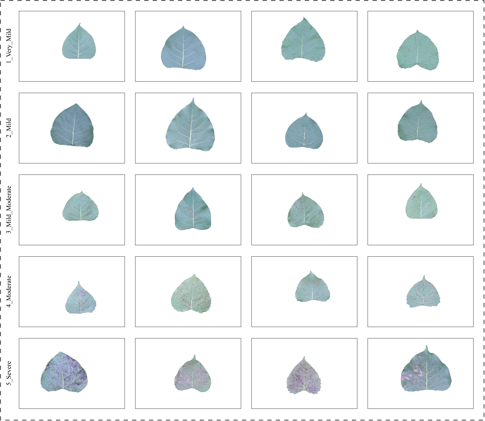

# PoplarFormer

### "PoplarFormer: A Hybrid Deep Learning Architecture for Ordinal Severity Grading of Poplar Black Spot Disease"


This repository provides the official implementation for **PoplarFormer**. The benchmark dataset **Poplar-BSR5** and the automated quantification pipeline **DPLS-IRQ** were also developed as part of this study.

Our work tackles the challenge of subjective and non-standardized assessment of poplar black spot disease by providing a complete, end-to-end quantitative framework.

## 📚 Table of Contents

- [Key Contributions](https://www.google.com/search?q=%23-key-contributions)
- [Model Architecture](https://www.google.com/search?q=%23-model-architecture)
- [Dataset: Poplar-BSR5](https://www.google.com/search?q=%23-dataset-poplar-bsr5)
- [Installation](https://www.google.com/search?q=%23-installation)
- [Usage](https://www.google.com/search?q=%23-usage)
- [Comparative Analysis](https://www.google.com/search?q=%23-comparative-analysis)
- [License](https://www.google.com/search?q=%23-license)

## 🎯 Key Contributions

1. **DPLS-IRQ Pipeline** 
2. **Poplar-BSR5 Dataset:** A new, large-scale benchmark dataset of 4,955 images, annotated with a scientifically-derived **five-level quantitative grading standard**.
3. **PoplarFormer Model:** A novel hybrid deep learning architecture that achieves state-of-the-art performance in this ordinal grading task.

## 🤖 Model Architecture

PoplarFormer is a dual-branch hybrid architecture built upon an advanced **EVA-02** backbone. It is designed to solve the key challenge of this task: capturing both fine-grained, isolated spots (early-stage) and large, coalesced patches (severe-stage).

It introduces two key components:

- **MSCEM** 
- **SFIM** 

The model is supervised by the **CORAL loss function** to explicitly embed the ordinal relationship between severity levels.

The overall architecture of PoplarFormer is shown below:

*The overall architecture of PoplarFormer.*

## 📁 Dataset: Poplar-BSR5

The Poplar-BSR5 dataset is the first large-scale benchmark for quantitative poplar black spot disease severity. Representative samples for each of the five severity classes are shown below:



### DPLS-IRQ Pipeline

All 4,955 images were labeled using our automated DPLS-IRQ pipeline, which precisely calculates the pixel-wise infection rate. The pipeline is shown below:

*The automated DPLS-IRQ pipeline.*

### Quantitative Grading Standard


## 🛠️ Installation

1. Clone the repository:

   ```
   git clone [https://github.com/chengJ914/PoplarFormer.git](https://github.com/chengJ914/PoplarFormer.git)
   cd PoplarFormer
   ```

2. Create a virtual environment (recommended):

   ```
   conda create -n poplarformer python=3.10
   conda activate poplarformer
   ```

3. Install dependencies:

   ```
   pip install -r requirements.txt
   ```

## 🚀 Usage

### Data Preparation

Download the Poplar-BSR5 dataset and arrange it in the following structure (e.g., in the project root directory):

```
poplar-bsr5/
  ├── 1_Very_Mild/
  │   ├── img_0001.jpg
  │   └── ...
  ├── 2_Mild/
  │   └── ...
  ├── 3_Mild_Moderate/
  │   └── ...
  ├── 4_Moderate/
  │   └── ...
  └── 5_Severe/
      └── ...
```

### Training

To train the PoplarFormer model:

```
python train.py
```

### Evaluation

To evaluate a trained checkpoint:

```
python evaluate.py
```

## 📊 Comparative Analysis

PoplarFormer significantly outperforms other baseline and SOTA models on the Poplar-BSR5 test set.

### Qualitative Results (Grad-CAM)

Visualizations show PoplarFormer's superior ability to focus on relevant pathological features (both fine-grained and coalesced) compared to the baseline, as shown below:

*Grad-CAM visualizations comparing the baseline (top row) vs. PoplarFormer (bottom row).*

## 📄 License


This project is licensed under the Apache 2.0 License - see the [LICENSE](https://www.google.com/search?q=LICENSE) file for details.


